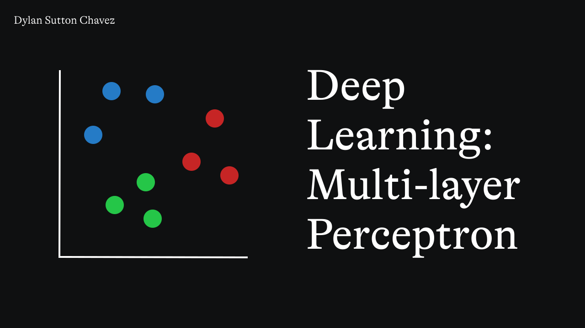

# Deep Learning; Multilayer-layer Perceptron

## Description

This project implements a **Multi-layer Perceptron (MLP)** for **text generation** based on a training dataset of phrases. The model leverages PyTorch to create and train a deep neural network capable of learning from the input text and generating subsequent words based on the learned sequence. In this case, the model predicts the next word in a sequence, making it suitable for applications in language modeling or sequence prediction.

## What is a Multi-layer Perceptron (MLP)?

A **Multi-layer Perceptron (MLP)** is a class of artificial neural network composed of multiple layers of neurons, where each neuron in a layer is connected to every neuron in the previous layer. It consists of:

1. **Input**: The input data (in this case, text data).
2. **Weights**: Parameters that are adjusted during training to optimize predictions.
3. **Bias**: An additional term added to the weighted sum of inputs to provide more flexibility in the model.
4. **Activation Function**: A function applied to the weighted sum to introduce non-linearity and help the model learn complex patterns (ReLU and softmax are used here).
5. **Output**: The predicted next word, represented as an index from the vocabulary.

### How It Works

The model learns to predict the next word in a sequence of words, trained on sequences of length '10' using the **Cross-Entropy Loss** function and **Adam optimizer**. During training, the MLP updates its parameters to minimize the error in its predictions.

The model works by:

- Embedding words into dense vectors using the **Embedding Layer**.
- Passing the sequence through a fully connected network with a hidden layer to capture complex relationships.
- Producing an output that represents the probability distribution over the vocabulary for the next word.

### Training with Gradient Descent

The model is trained using **gradient descent** with the **Adam optimizer**. The loss function used is **Cross-Entropy Loss**, which is suitable for classification tasks. The training process involves adjusting the weights and biases to minimize prediction error over multiple epochs.

### Early Stopping

To avoid **overfitting**, **early stopping** is used. If the loss does not improve for a specified number of consecutive epochs, training stops early.

## Project Features

- **Data Preprocessing:** Text is tokenized, cleaned, and prepared for training.
- **Text Vectorization:** Words are mapped to indices in a vocabulary.
- **Model Training:** The MLP model is trained with a specified batch size and number of epochs.
- **Trained Model:** The trained model and vocabulary are saved in 'storyModel.pkl'.
- **Model Evaluation:** The model is evaluated by tracking loss and accuracy.

## Requirements

- **Python 3.x**
- **torch**

## To Run the Training:

1. **Install Dependencies**  
   Run the following command in your terminal: 'pip install -r requirements.txt'

2. **Run the Training**  
   Start training by running: 'python trainPerceptron.py'

## To Run Inference:

1. **Install Dependencies**  
   Ensure dependencies are installed by running: 'pip install -r requirements.txt'

2. **Run Inference**  
   Execute inference by running: 'python inferencePerceptron.py'
